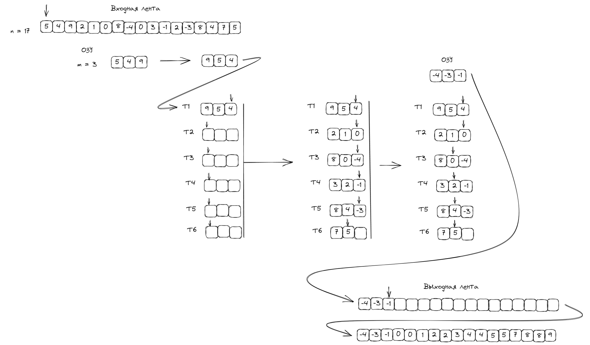

### Сборка проекта 
`./make`

### Запуск приложения
`./main data/input.txt data/output.txt`

### Сборка тестового приложения  
`./make build_test`

### Сборка тестового приложения  
`./make build_test`

### Запуск приложения
`./test`

#### Конфигурационный файл

Расположен в корне проекта [config](config.txt)

В данном файле записаны (на соответствующих строчках)

1. Длинна входного файла
2. Размер ОЗУ
3. Размер задержки для чтения/записи
4. Размер задержки для перемотки ленты
5. Размер задержки для сдвига на позицию

#### Входные данные 

При запуске приложения ему передаются пути к [входной ленте](data/input.txt) и [выходной ленте](data/output.txt)

#### Алгоритм сортировки

`N` - Количество элементов на входной ленте  
`M` - Максимальное количество элементов, которые могут быть записаны на ОЗУ

1. Запись отсортированных данных на дополнительные ленты
+ Мы создаем дополнительные ленты размером `M`, в количестве `N`/`M` штук
+ Начинаем читать данные с входной ленты в ОЗУ
+ Отсортировываем эти данные по убыванию (для того, чтобы потом не возвращать указатель на начало)
+ Записываем их на дополнительную ленту
+ Данные процесс повторяем пока не заполним все ленты
2. Запись данных на выходную ленту 
+ Начиная с первой ленты ищем наименьшие значения и записываем их в ОЗУ по возрастанию
+ После того как `M` самых маленьких чисел записаны в ОЗУ мы записываем их в выходную ленту, и в соответствующих лентах сдвигаем указатель назад
+ Данные процесс повторяем все не запишутся все данные на выходную ленту 

Основная идея алгоритма - мы полностью избавились от использования функции передвижения ленты на произвольную позицию(которая является самой затратной по времени)

